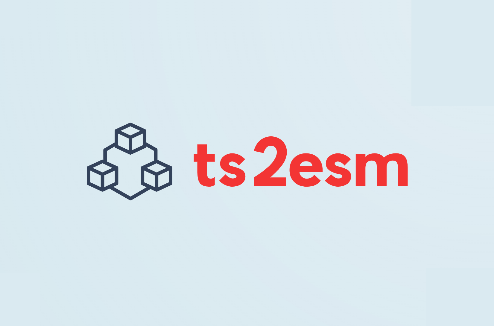

# ts2esm



Fixes your relative TypeScript imports & exports automatically, converting them into ESM-compatible imports & exports with explicit `.js` file extensions. 🪄

## Examples

### Import

Turns:

```ts
import {AccountAPI} from '../account';
import {RESTClient} from './client/RESTClient';
```

Into:

```ts
import {AccountAPI} from '../account/index.js';
import {RESTClient} from './client/RESTClient.js';
```

### Export

Turns:

```ts
export * from './account';
export * from './UserAPI';
```

Into:

```ts
export * from './account/index.js';
export * from './UserAPI.js';
```

## Installation

Simply run this command to install `ts2esm` globally on your machine:

```bash
npm i -g ts2esm
```

Afterwards, just launch the program inside the directory of your TS project (it will ask you for your `tsconfig.json`):

```bash
ts2esm
```

> [!WARNING]  
> Make sure you have a backup (in Git or similar) of your code as this program will modify your source code.

## How it works

The `ts2esm` program adjusts your relative imports, adding extensions like `index.js` or `.js` to make them ESM-compatible. Say goodbye to import errors such as **TS2834** or [**TS2835**](https://typescript.tv/errors/#ts2835)!

> error TS2834: Relative import paths need explicit file extensions in EcmaScript imports when '--moduleResolution' is 'node16' or 'nodenext'. Consider adding an extension to the import path.

> error TS2835: Relative import paths need explicit file extensions in EcmaScript imports when '--moduleResolution' is 'node16' or 'nodenext'.

## Credits

This program was born from an [inspiring conversation](https://twitter.com/bennycode/status/1693362836695585084) I had with [Basarat Ali Syed](https://twitter.com/basarat). I recommend checking out [Basarat's coding tutorials](https://www.youtube.com/@basarat). 👍

## References

- [TypeScript's Module Resolution](https://www.typescriptlang.org/docs/handbook/modules/theory.html#module-resolution-is-host-defined)
- [TypeScript AST Viewer](https://ts-ast-viewer.com/)
- [Are the types wrong?](https://github.com/arethetypeswrong/arethetypeswrong.github.io)
